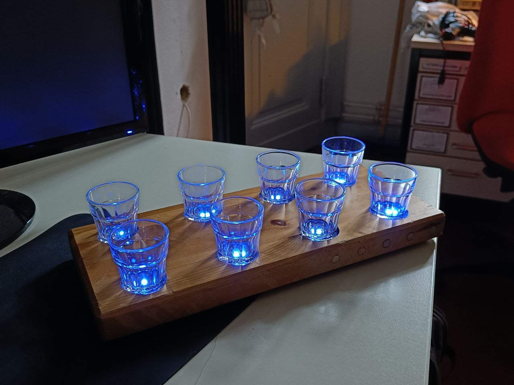

# LED Shot Tray

The following repository contains the firmware for our LED Party Shot Tray. The firmware is a trimmed down and slightly modified fork of [this WS2812 controller](https://github.com/CTXz/Not-so-Tiny-Dimmer).

## Hardware

In its heart, the LED Shot Tray uses a Digispark USB with an Attiny85. The RGB LEDs that we use are 5mm WS2812B LEDs (also commonly known as "Neopixels"). The whole thing is powered by a 9V battery. The voltage is regulated down to 5V using the internal regulator of the Digispark.

## Usage

Using the LED Shot Tray is pretty simple and straightforward:
  - Simply turn the device on using the switch on the side
  - After a boot up delay of a couple of seconds, the LEDs will start to display one out of three possible effects:
    - **Hue Cycle**: All LEDs will simulatenously cycle through the whole color spectrum.
    - **Gaming Mode (super epic)**: All LEDs will light up in a rainbow pattern. The pattern rapidly cycles trough the whole tray.
    - **Rain**: LEDs will fade in and out in a random pattern, either in cyan or magenta.
  - With each power up, the effect will change, meaning that you can cycle through all three effects by simply turning the tray off and on again (Note that you must wait for the tray to boot up completely before turning it off again.)

> **Warning:** Cycling through effects is achieved by using the EEPROM of the Attiny85. "Spamming" the power switch may corrupt and can eventually even permanently kill the EEPROM!

## Flashing The Firware

The firmware can be flashed using PlatformIO. Please install the PlatformIO environment for VSCode.

### If a bootloader is present
If the Digispark USB has a bootloader installed, select the "Digispark" enviroment in the bottom toolbar and upload the firmware using the "Upload" button in the bottom toolbar. Once prompted, plug in the Digispark USB and wait for the upload to finish.

As a tip: Use a USB extension cable to make the Digispark USB more accessible.

### If no bootloader is present
If the Digispark USB has no bootloader, flashing the firmware requires an ISP programmer. Connect the ISP programmer to the Digispark USB (find the pinout online) and configure the "Attiny85" environment in the `platformio.ini` file (See https://docs.platformio.org/en/stable/platforms/atmelavr.html) to use your ISP programmer. Next, select the "Attiny85" environment from the bottom toolbar, and upload the firmware by clicking the "Upload" button.
